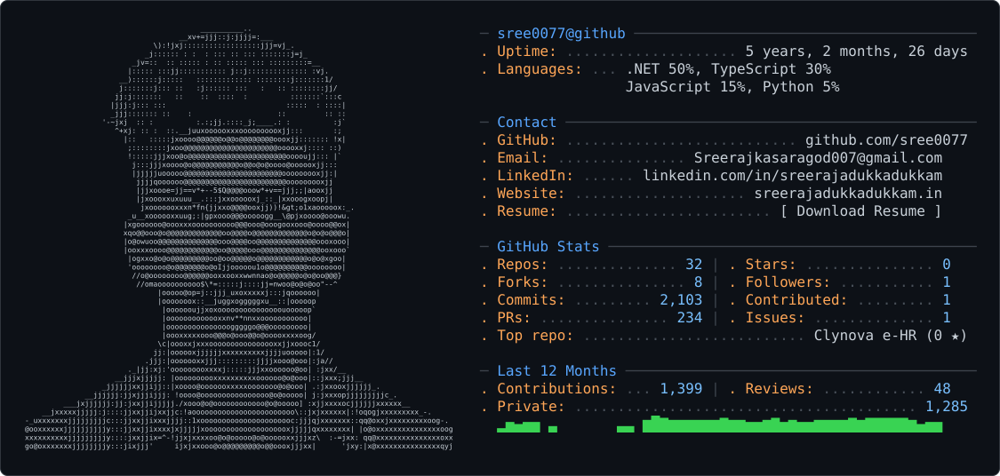

<picture>
  <source media="(prefers-color-scheme: dark)" srcset="dark_mode.svg" />
  <source media="(prefers-color-scheme: light)" srcset="light_mode.svg" />
  
</picture>

<!-- SVG links are not interactive when embedded as an image, so keep these shortcuts accessible. -->

  <a href="mailto:Sreerajkasaragod007@gmail.com">Email</a> ·
  <a href="https://www.linkedin.com/in/sreerajadukkadukkam/">LinkedIn</a> ·
  <a href="https://sreerajadukkadukkam.in">Website</a> ·
  <a href="https://github.com/sree0077/sree0077/raw/refs/heads/main/sreeraj-resume.pdf?download=1">Download Resume</a>

